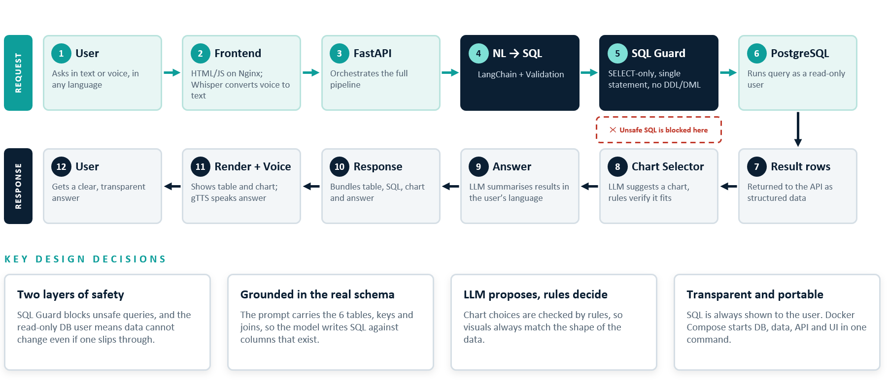
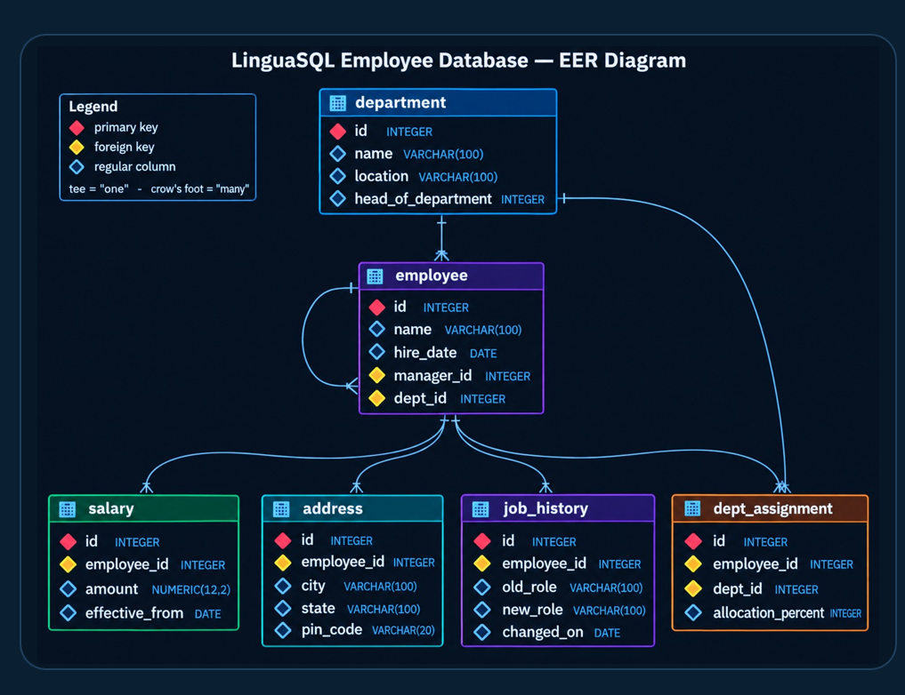

# LinguaSQL
  
> **Live Demo:** [http://13.206.248.246](http://13.206.248.246)

Ask your database anything in plain English or voice in your spoken language. LinguaSQL translates natural language queries into validated, secure SQL, executes them on PostgreSQL, and presents auto-generated charts, structured data tables, and natural language summaries.

---

## 👥 Team Members

* Himel Biswas
* Ardina Banerjee
* Sudeshna Paul
* Krishna Kanta Rana
* Masud Mallik
* SK Shahanul Haque

---

## ✨ Key Features

* **Multilingual Querying:** Query data using text or speech in English, Hindi, or Bengali.
* **Voice Capabilities:** Integrated with Groq Whisper for speech recognition and gTTS for spoken responses.
* **Two-Layer Security:** SQL Guard validation coupled with a read-only PostgreSQL database user.
* **Smart Visualization:** Automated chart selection verified by programmatic rules.
* **Multi-Format Ingestion:** Query live PostgreSQL databases or upload `.xlsx`, `.csv`, and `.pdf` files.
* **Export Options:** Download results, SQL queries, and generated charts directly as PDF or Excel files.
* **Built-in Evaluation:** Automated benchmarking module to test SQL accuracy against expected outputs.

---

## 🏗 System Architecture

The pipeline processes user questions through natural language translation, security validation, query execution, and visual rendering:



---

## 🗄 Database EER Diagram

The database models relational dependencies across employee hierarchies, departments, compensation, and history:



---

## ☁️ Cloud Infrastructure

Deployed on AWS (`ap-south-1` region) with isolation between public application tiers and private database services:

* **Compute:** Amazon ECS on EC2 `t3.small` running Nginx frontend & FastAPI backend.
* **Container Registry:** Amazon ECR.
* **Database:** Amazon RDS (PostgreSQL) isolated in private subnets.
* **Secrets:** AWS SSM Parameter Store.

---

## 🚀 Getting Started

### Prerequisites
* Docker & Docker Compose

### Quickstart with Docker Compose

Run the entire application stack locally with a single command:

```bash
# Clone repository
git clone [https://github.com/Himel564/Ask-the-Database-in-Plain-English.git)
cd Ask-the-Database-in-Plain-English

# Start services
docker-compose up --build -d
